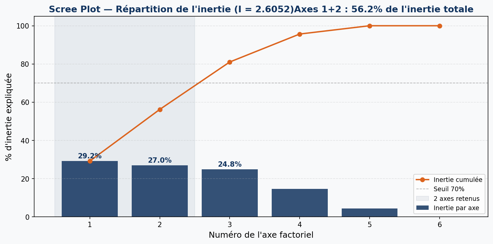
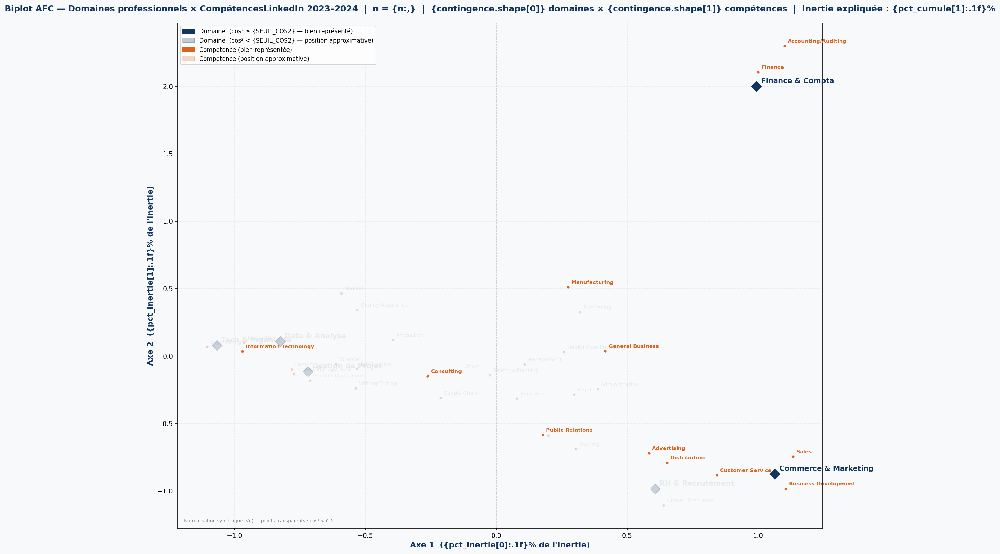

# AFC — Analyse Factorielle des Correspondances


## Domaines professionnels × Compétences · LinkedIn 2023–2024

> **ENSA Khouribga · Université Sultan Moulay Slimane**  
> Module : Statistiques / Traitement de Données · Année 2025–2026  
> Encadrant : **Prof. AGHRICH Ahmed**  
> Auteurs : **SADIK Mohammed** · **NOUGBOLO Godwin Elie**

---

## Question de départ

> **Quelles compétences sont typiquement associées à quels domaines professionnels sur LinkedIn ?**

---

## Présentation du projet

Ce projet applique l'**Analyse Factorielle des Correspondances (AFC)** à des offres d'emploi LinkedIn (2023–2024) pour identifier et visualiser les liens statistiques entre domaines professionnels et compétences requises.

L'AFC est l'équivalent de l'ACP pour les variables qualitatives. Elle permet de passer d'un tableau de contingence complexe (domaines × compétences) à un **biplot** 2D interprétable, où la proximité entre un domaine et une compétence reflète la force de leur association.

L'analyse est entièrement implémentée **from scratch** en Python — sans bibliothèque AFC dédiée — en suivant les 8 étapes mathématiques du pipeline :

1. Construction du tableau de contingence
2. Calcul des fréquences relatives et des marges
3. Calcul des profils lignes et colonnes
4. Test du χ² et inertie totale
5. Construction de la matrice des résidus standardisés Z
6. Décomposition SVD et coordonnées factorielles
7. Qualité de représentation (cos²)
8. Contributions (CTR) et biplot final

---

## Structure du dépôt

```
AFC/
├── notebooks/
│   └── afc_notebook.ipynb      ← pipeline complet (13 étapes commentées)
├── data/
│   └── raw/
│       ├── postings.csv        ← offres d'emploi LinkedIn (job_id, titre, etc.)
│       ├── job_skills.csv      ← liaison offre → compétence (job_id, skill_abr)
│       └── skills.csv          ← table de correspondance abréviation → nom complet
├── reports/
│   ├── figures/
│   │   ├── biplot_afc.png      ← biplot final exporté
│   │   └── screeplot.png       ← Scree Plot (répartition de l'inertie)
│   └── AFc [Enregistrement automatique].pdf   ← support de présentation théorique
├── src/                        ← scripts auxiliaires
├── requirements.txt
├── .gitignore
└── README.md
```

---

## Données

**Source** : [LinkedIn Job Postings (2023–2024)](https://www.kaggle.com/datasets/arshkon/linkedin-job-postings) — Kaggle

| Fichier | Contenu |
|---|---|
| `postings.csv` | Offres d'emploi brutes (job_id, titre, localisation, …) |
| `job_skills.csv` | Liaison offre → compétence (`job_id`, `skill_abr`) |
| `skills.csv` | Table abréviation → nom complet (`skill_abr`, `skill_name`) |

---

## Domaines analysés

Les titres de postes ont été regroupés en **6 domaines homogènes** pour garantir la stabilité statistique (≥ 200 offres uniques par domaine) :

| Domaine | Mots-clés représentatifs |
|---|---|
| **Tech & Ingénierie** | software engineer, devops, cloud, cybersecurity, … |
| **Data & Analyse** | data scientist, machine learning, analyst, … |
| **Gestion de Projet** | project manager, scrum, product owner, … |
| **Commerce & Marketing** | marketing, sales, business development, … |
| **Finance & Compta** | financial analyst, accountant, auditor, … |
| **RH & Recrutement** | recruiter, HR, talent acquisition, … |

---

## Résultats clés

| Indicateur | Valeur |
|---|---|
| Inertie totale (I = χ²/n) | **2.6052** |
| Inertie expliquée Axe 1 | **29.2 %** |
| Inertie expliquée Axe 2 | **27.0 %** |
| **Inertie cumulée Axes 1+2** | **56.2 %** |

### Associations principales identifiées

- **Finance & Compta** ↔ `Accounting/Auditing`, `Finance` — cluster très isolé, association forte et exclusive.
- **Commerce & Marketing** ↔ `Sales`, `Business Development`, `Customer Service`, `Distribution`.
- **Tech & Ingénierie** / **Data & Analyse** ↔ `Information Technology` — deux domaines proches, partageant des compétences transverses.
- **RH & Recrutement** ↔ compétences RH spécifiques (`HR`, `Recruiting`, …) — bien représenté sur l'axe 2.

### Qualité de représentation (cos²)

Les points avec **cos² ≥ 0.5** sont bien représentés sur le plan 2D et peuvent être commentés. Les points avec cos² < 0.5 sont affichés en transparence sur le biplot.

---

## Visualisations

### Scree Plot

Répartition de l'inertie par axe. Les axes 1 et 2 sont retenus (zone grisée), capturant 56.2 % de l'inertie totale.



### Biplot final

Domaines (losanges bleus) et compétences (points orange) projetés sur le plan factoriel (Axe 1 × Axe 2). La proximité d'un domaine et d'une compétence indique une association forte.



---

## Installation et utilisation

```bash
# 1. Cloner le projet
git clone <[url-du-repo](https://github.com/Godwin-08/AFC-Analyse-Factorielle-Correspondances)>
cd AFC

# 2. Créer et activer l'environnement virtuel
python -m venv .venv
# Windows
.venv\Scripts\activate
# Linux / macOS
source .venv/bin/activate

# 3. Installer les dépendances
pip install -r requirements.txt

# 4. Lancer Jupyter Lab
jupyter lab

# 5. Ouvrir et exécuter le notebook
# → notebooks/afc_notebook.ipynb
```

**Prérequis** : placer les trois fichiers CSV (`postings.csv`, `job_skills.csv`, `skills.csv`) dans `data/raw/` avant d'exécuter le notebook.

---

## Dépendances

```
pandas
numpy
matplotlib
scipy
jupyterlab
ipython
```

---

## Pipeline mathématique (résumé)

```
postings.csv + job_skills.csv + skills.csv
        ↓  fusion + filtrage + regroupement
  Tableau de contingence  (6 domaines × K compétences)
        ↓  fréquences relatives + marges
  Profils lignes et colonnes
        ↓  test du χ²  →  inertie totale I = χ²/n
  Matrice des résidus Z  (standardisation par les marges)
        ↓  SVD : Z = U · diag(σ) · Vᵀ
  Coordonnées factorielles (domaines + compétences)
        ↓  cos²  →  qualité de représentation
        ↓  CTR   →  interprétation des axes
  Biplot final  (Axe 1 × Axe 2)
```

---

## Limites de l'analyse

- L'échantillon LinkedIn ne couvre pas l'ensemble du marché du travail mondial.
- Le regroupement en 6 domaines introduit une part de subjectivité dans le choix des mots-clés.
- Les 2 axes retenus capturent 56.2 % de l'inertie — 43.8 % de l'information reste dans les axes suivants.
- Les compétences avec cos² < 0.5 ne doivent pas être interprétées depuis le biplot.
