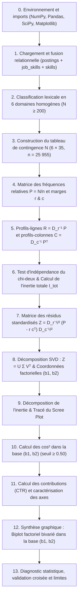

<div align="center">

# Analyse Factorielle des Correspondances (AFC)
### *Cartographie des relations entre Domaines Professionnels et Compétences sur LinkedIn*

[](https://www.python.org/)
[](https://numpy.org/)
[](https://pandas.pydata.org/)
[](https://scipy.org/)
[](https://jupyter.org/)
[](https://www.kaggle.com/datasets/arshkon/linkedin-job-postings)
[](LICENSE)

<br/>

**École Nationale des Sciences Appliquées de Khouribga (ENSAK)**  
*Université Sultan Moulay Slimane*  
**Module** : Statistiques Appliquées & Traitement de Données · Année universitaire 2025–2026  
**Encadrant** : **Prof. Ahmed AGHRICH**  
**Auteurs** : **Mohammed SADIK** · **Godwin Elie NOUGBOLO**

</div>

---

## Table des matières

1. [Problématique et question de départ](#problématique-et-question-de-départ)
2. [Présentation générale du projet](#présentation-générale-du-projet)
3. [Fondements théoriques et formalisation mathématique](#fondements-théoriques-et-formalisation-mathématique)
   - [Tableau de contingence et fréquences relatives](#1-tableau-de-contingence-et-fréquences-relatives)
   - [Profils lignes, profils colonnes et métrique du chi-deux](#2-profils-lignes-profils-colonnes-et-métrique-du-chi-deux)
   - [Test d'indépendance du chi-deux et inertie totale](#3-test-dindépendance-du-chi-deux-et-inertie-totale)
   - [Matrice des résidus standardisés et décomposition SVD](#4-matrice-des-résidus-standardisés-et-décomposition-en-valeurs-singulières-svd)
   - [Coordonnées factorielles dans la base du plan factoriel (b1, b2)](#5-coordonnées-factorielles-dans-la-base-du-plan-factoriel-b1-b2)
   - [Qualité de représentation (cosinus carré) et contributions relatives](#6-qualité-de-représentation-cosinus-carré-et-contributions-relatives)
4. [Source des données et prétraitement](#source-des-données-et-prétraitement)
5. [Pipeline algorithmique pas-à-pas](#pipeline-algorithmique-pas-à-pas)
6. [Résultats statistiques et interprétation](#résultats-statistiques-et-interprétation)
   - [Test d'indépendance du chi-deux et inertie](#1-test-du-chi-deux-et-inertie-totale)
   - [Décomposition spectrale et Scree Plot](#2-décomposition-spectrale-et-scree-plot)
   - [Analyse détaillée des axes factoriels](#3-analyse-détaillée-des-axes-factoriels)
   - [Qualité de représentation et contributions](#4-qualité-de-représentation-et-contributions)
7. [Visualisations du plan factoriel](#visualisations-du-plan-factoriel)
8. [Discussion critique et limites méthodologiques](#discussion-critique-et-limites-méthodologiques)
9. [Architecture du dépôt](#architecture-du-dépôt)
10. [Guide d'installation et exécution](#guide-dinstallation-et-exécution)
11. [Références bibliographiques](#références-bibliographiques)

---

## Problématique et question de départ

> **« Quelles compétences professionnelles sont préférentiellement ou exclusivement associées à quels domaines métiers sur le marché de l'emploi LinkedIn contemporain ? »**

Dans le cadre du recrutement moderne, la description des compétences requises présente souvent une forte dimensionnalité et des recouvrements transversaux. L'objectif central de ce projet est de déterminer empiriquement si l'adéquation entre intitulé de domaine professionnel et profil de compétences répond à une distribution purement aléatoire, ou si elle structure un espace latent mesurable, identifiable et interprétable par réduction de dimension.

---

## Présentation générale du projet

L'**Analyse Factorielle des Correspondances (AFC)**, introduite par *Jean-Paul Benzécri* (1973), est une méthode d'analyse multivariée exploratoire conçue pour analyser les tableaux de contingence croisant deux variables qualitatives. Elle constitue le pendant de l'Analyse en Composantes Principales (ACP) pour les données catégorielles discrètes.

### Points forts de l'implémentation
- **Implémentation intégrale sans boîte noire (*from scratch*)** : L'ensemble du formalisme mathématique (profils, métrique du $\chi^2$, matrice des résidus standardisés $Z$, décomposition en valeurs singulières SVD, coordonnées factorielles, $\cos^2$, CTR) est codé exclusivement avec **NumPy**, **Pandas** et **SciPy**, sans faire appel à des bibliothèques externes d'analyse factorielle (telles que `prince` ou `FactoMineR`).
- **Rigueur méthodologique** : Vérification systématique des conditions de validité statistique (effectifs minimaux, test d'adéquation du $\chi^2$, détection des sur-représentations, filtrage par $\cos^2$).
- **Visualisation biplot bivariée** : Projection conjointe des domaines (profils-lignes) et des compétences (profils-colonnes) dans le plan factoriel optimal avec gestion graphique de la significativité ($\cos^2 \ge 0{,}5$).

---

## Fondements théoriques et formalisation mathématique

Considérons un tableau de contingence $N = (n_{ij})_{\substack{1 \le i \le I \\ 1 \le j \le J}}$ croisant $I$ domaines professionnels et $J$ compétences requises.

### 1. Tableau de contingence et fréquences relatives

L'effectif total observé $n$ est la somme de toutes les cases du tableau :

$$n = \sum_{i=1}^I \sum_{j=1}^J n_{ij}$$

La fréquence relative $f_{ij}$ représente la proportion d'offres associant le domaine $i$ et la compétence $j$ :

$$f_{ij} = \frac{n_{ij}}{n}$$

On définit les **marges** (ou masses marginales) :

- **Marge ligne $r_i$** (poids relatif du domaine $i$) :
  $$r_i = \sum_{j=1}^J f_{ij} = \frac{n_{i\cdot}}{n} \quad \text{avec} \quad \sum_{i=1}^I r_i = 1$$

- **Marge colonne $c_j$** (poids relatif de la compétence $j$) :
  $$c_j = \sum_{i=1}^I f_{ij} = \frac{n_{\cdot j}}{n} \quad \text{avec} \quad \sum_{j=1}^J c_j = 1$$

Ces masses marginales sont regroupées sous forme de matrices diagonales :

$$D_r = \text{diag}(r_1, r_2, \dots, r_I) \qquad \text{et} \qquad D_c = \text{diag}(c_1, c_2, \dots, c_J)$$

---

### 2. Profils lignes, profils colonnes et métrique du chi-deux

Pour affranchir l'analyse des simples effets de taille (un domaine comportant beaucoup d'offres aura mécaniquement des effectifs bruts plus élevés), on calcule les profils conditionnels :

- **Profil ligne du domaine $i$** (répartition des compétences au sein de ce domaine) :
  $$\text{Profil ligne } i = \left( \frac{f_{ij}}{r_i} \right)_{j=1, \dots, J} \quad \text{avec} \quad \sum_{j=1}^J \frac{f_{ij}}{r_i} = 1$$

- **Profil colonne de la compétence $j$** (répartition des domaines au sein de cette compétence) :
  $$\text{Profil colonne } j = \left( \frac{f_{ij}}{c_j} \right)_{i=1, \dots, I} \quad \text{avec} \quad \sum_{i=1}^I \frac{f_{ij}}{c_j} = 1$$

- **Profils moyens** :
  - Le profil moyen des lignes est donné par le vecteur des marges colonnes $(c_1, \dots, c_J)$.
  - Le profil moyen des colonnes est donné par le vecteur des marges lignes $(r_1, \dots, r_I)$.

La distance entre deux domaines $i$ et $i'$ est mesurée par la **métrique du $\chi^2$**, qui pondère l'écart par l'inverse de la fréquence moyenne de chaque compétence :

$$d_{\chi^2}^2(i, i') = \sum_{j=1}^J \frac{1}{c_j} \left( \frac{f_{ij}}{r_i} - \frac{f_{i'j}}{r_{i'}} \right)^2$$

Cette métrique respecte le principe d'équivalence distributionnelle de Benzécri.

---

### 3. Test d'indépendance du chi-deux et inertie totale

Avant d'extraire des axes factoriels, on teste l'hypothèse nulle $H_0$ : *« Il y a indépendance statistique entre domaines professionnels et compétences »*.

Sous l'hypothèse $H_0$, l'effectif théorique attendu dans la cellule $(i, j)$ vaut :

$$e_{ij} = n \cdot r_i \cdot c_j = \frac{n_{i\cdot} \times n_{\cdot j}}{n}$$

La statistique du test du $\chi^2$ s'écrit :

$$\chi^2 = \sum_{i=1}^I \sum_{j=1}^J \frac{(n_{ij} - e_{ij})^2}{e_{ij}} = n \sum_{i=1}^I \sum_{j=1}^J \frac{(f_{ij} - r_i c_j)^2}{r_i c_j}$$

avec un nombre de degrés de liberté égal à :

$$ddl = (I - 1) \times (J - 1)$$

L'**inertie totale** $\mathcal{I}$ mesure la dispersion globale du nuage des profils autour du profil moyen. Elle est directement reliée à la statistique du $\chi^2$ :

$$\mathcal{I} = \frac{\chi^2}{n} = \sum_{i=1}^I \sum_{j=1}^J \frac{(f_{ij} - r_i c_j)^2}{r_i c_j}$$

---

### 4. Matrice des résidus standardisés et décomposition en valeurs singulières (SVD)

L'écart relatif entre fréquences observées et fréquences théoriques sous indépendance est modélisé par la **matrice des résidus standardisés** $Z \in \mathbb{R}^{I \times J}$ :

$$Z_{ij} = \frac{f_{ij} - r_i \cdot c_j}{\sqrt{r_i \cdot c_j}}$$

Sous forme matricielle :

$$Z = D_r^{-1/2} \, (P - r \, c^T) \, D_c^{-1/2}$$

On vérifie immédiatement la conservation de l'inertie :

$$\sum_{i=1}^I \sum_{j=1}^J Z_{ij}^2 = \text{Trace}(Z \, Z^T) = \mathcal{I}$$

La Décomposition en Valeurs Singulières (SVD) de la matrice $Z$ s'écrit :

$$Z = U \, \Sigma \, V^T$$

où :
- $U \in \mathbb{R}^{I \times K}$ est la matrice des vecteurs singuliers à gauche ($U^T U = I_K$),
- $V \in \mathbb{R}^{J \times K}$ est la matrice des vecteurs singuliers à droite ($V^T V = I_K$),
- $\Sigma = \text{diag}(\sigma_1, \sigma_2, \dots, \sigma_K)$ contient les valeurs singulières ordonnées : $\sigma_1 \ge \sigma_2 \ge \dots \ge \sigma_K > 0$,
- Le nombre maximal d'axes non triviaux est $K = \min(I-1, J-1)$.

Les **valeurs propres** associées à chaque axe factoriel $k$ correspondent aux carrés des valeurs singulières :

$$\lambda_k = \sigma_k^2 \qquad \text{avec} \qquad \sum_{k=1}^K \lambda_k = \mathcal{I}$$

La part d'inertie expliquée par l'axe $k$ s'exprime par :

$$\tau_k = \frac{\lambda_k}{\mathcal{I}} \times 100$$

---

### 5. Coordonnées factorielles dans la base du plan factoriel (b1, b2)

Les deux premiers axes factoriels issus de la décomposition définissent les deux vecteurs de base du plan factoriel principal, notés ici **$b_1$** (Axe factoriel 1) et **$b_2$** (Axe factoriel 2).

Pour permettre une lecture directe des proximités entre domaines et compétences sur le biplot, nous appliquons une **normalisation symétrique** en répartissant le facteur d'échelle $\sqrt{\sigma_k}$ équitablement entre les lignes et les colonnes.

#### Coordonnées des domaines (profils lignes) sur l'axe $k$ :

$$F_{i, k} = \frac{U_{i, k} \cdot \sqrt{\sigma_k}}{\sqrt{r_i}}$$

Pour chaque domaine $i$, le vecteur de coordonnées dans la base factorielle $(b_1, b_2)$ est :

$$\mathbf{x}_i = \begin{pmatrix} F_{i, 1} \\ F_{i, 2} \end{pmatrix}$$

#### Coordonnées des compétences (profils colonnes) sur l'axe $k$ :

$$G_{j, k} = \frac{V_{j, k} \cdot \sqrt{\sigma_k}}{\sqrt{c_j}}$$

Pour chaque compétence $j$, le vecteur de coordonnées dans la base factorielle $(b_1, b_2)$ est :

$$\mathbf{y}_j = \begin{pmatrix} G_{j, 1} \\ G_{j, 2} \end{pmatrix}$$

#### Propriétés géométriques dans la base $(b_1, b_2)$ :
- La distance euclidienne de la modalité $i$ à l'origine dans le plan $(b_1, b_2)$ vaut :
  $$d^2(i, \text{centre})_{b_1, b_2} = F_{i, 1}^2 + F_{i, 2}^2$$
- La proximité géométrique entre un domaine $\mathbf{x}_i$ et une compétence $\mathbf{y}_j$ dans la base $(b_1, b_2)$ traduit l'intensité de leur sur-représentation conjointe ($Z_{ij} > 0$).

---

### 6. Qualité de représentation (cosinus carré) et contributions relatives

#### Qualité de représentation sur la base $(b_1, b_2)$ : le cosinus carré ($\cos^2$)
La projection d'un espace à $K$ dimensions sur le plan $(b_1, b_2)$ entraîne une perte d'information. Le $\cos^2$ mesure la fraction de l'écart au profil moyen restituée par le plan $(b_1, b_2)$ :

$$\cos^2(i, \text{plan } b_1\text{-}b_2) = \frac{F_{i, 1}^2 + F_{i, 2}^2}{\displaystyle\sum_{k=1}^K F_{i, k}^2}$$

$$\cos^2(j, \text{plan } b_1\text{-}b_2) = \frac{G_{j, 1}^2 + G_{j, 2}^2}{\displaystyle\sum_{k=1}^K G_{j, k}^2}$$

> **Règle de décision statistique** :
> - Si $\cos^2(i, \text{plan } b_1\text{-}b_2) \ge 0{,}50$ : le point est fidèlement projeté dans la base $(b_1, b_2)$ ; ses proximités peuvent être interprétées en toute rigueur.
> - Si $\cos^2(i, \text{plan } b_1\text{-}b_2) < 0{,}50$ : le point s'exprime principalement sur les axes ultérieurs ($b_3, b_4, \dots$) ; sa position apparente sur le plan $(b_1, b_2)$ peut être trompeuse et est affichée en transparence sur le biplot.

#### Contribution relative d'un point à la construction d'un axe (CTR)
La contribution relative ($CTR$) indique la part de variance d'un axe factoriel $k$ due à une modalité donnée :

- **Contribution du domaine $i$ à l'axe $k$** :
  $$CTR(i, k) = \frac{r_i \cdot F_{i, k}^2}{\lambda_k} \qquad \text{avec} \qquad \sum_{i=1}^I CTR(i, k) = 1 \ (100\%)$$

- **Contribution de la compétence $j$ à l'axe $k$** :
  $$CTR(j, k) = \frac{c_j \cdot G_{j, k}^2}{\lambda_k} \qquad \text{avec} \qquad \sum_{j=1}^J CTR(j, k) = 1 \ (100\%)$$

---

## Source des données et prétraitement

### Jeu de données
Les données exploitées proviennent du jeu de données public [LinkedIn Job Postings (2023–2024)](https://www.kaggle.com/datasets/arshkon/linkedin-job-postings) hébergé sur la plateforme Kaggle, composé de trois tables relationnelles :

| Fichier | Volume brut | Description fonctionnelle |
|---|---|---|
| `postings.csv` | 123 849 lignes | Métadonnées de l'offre d'emploi (`job_id`, `job_title`, entreprise, localisation, etc.) |
| `job_skills.csv` | 213 768 lignes | Table de jointure plusieurs-à-plusieurs (`job_id`, `skill_abr`) |
| `skills.csv` | 35 lignes | Référentiel des compétences (`skill_abr`, `skill_name`) |

### Taxonomie des 6 domaines d'analyse
Afin de neutraliser le bruit statistique lié à la granularité excessive des intitulés libres et de respecter la règle empirique de robustesse statistique ($N \ge 200$ offres uniques par modalité), les postes ont été catégorisés par extraction lexico-sémantique en 6 grands domaines d'activité :

```
                        Répartition des Offres Uniques par Domaine
                        ──────────────────────────────────────────
Commerce & Marketing   ================================  3 515 offres
Gestion de Projet      ==============================    3 344 offres
Tech & Ingénierie      ========================          2 673 offres
Finance & Compta       ==================                2 056 offres
Data & Analyse         ===============                   1 689 offres
RH & Recrutement       ==========                        1 099 offres
```

Le croisement final produit un **tableau de contingence de dimensions $6 \times 35$** totalisant **$n = 25\,955$** observations conjointes effectives.

---

## Pipeline algorithmique pas-à-pas

Le projet suit rigoureusement un pipeline séquentiel en **13 étapes** implémenté dans le notebook [`notebooks/afc_notebook.ipynb`](notebooks/afc_notebook.ipynb) :



---

## Résultats statistiques et interprétation

### 1. Test du chi-deux et inertie totale

Les résultats numériques confirment sans ambiguïté la dépendance statistique entre les domaines professionnels et les compétences requises :

| Indicateur statistique | Valeur observée | Interprétation |
|---|---|---|
| **Statistique $\chi^2$** | **$67\,617{,}28$** | Écart très marqué par rapport au modèle d'indépendance |
| **Degrés de liberté ($ddl$)** | $(6-1) \times (35-1) = \mathbf{170}$ | Nombre de cellules indépendantes du tableau |
| **$p$-value** | **$< 1{,}0 \times 10^{-16}$** ($0{,}0000$) | Rejet catégorique de l'hypothèse d'indépendance $H_0$ |
| **Effectif total ($n$)** | **$25\,955$** | Effectif robuste assurant la stabilité des calculs |
| **Inertie Totale ($\mathcal{I}$)** | **$2{,}6052$** | Somme des inerties factorielles |

La relation théorique $\sum_{i,j} Z_{ij}^2 = \sum_{k=1}^5 \lambda_k = \mathcal{I} = 2{,}605174$ est vérifiée à la précision machine ($\Delta < 10^{-15}$).

---

### 2. Décomposition spectrale et Scree Plot

L'espace factoriel compte $K = \min(6-1, 35-1) = 5$ axes factoriels :

| Axe factoriel (Base) | Valeur propre ($\lambda_k$) | % Inertie expliquée | % Inertie cumulée | Rôle dans l'analyse |
|:---:|:---:|:---:|:---:|:---:|
| **Axe $b_1$** | **$0{,}7601$** | **$29{,}18\%$** | **$29{,}18\%$** | Premier axe directeur du plan |
| **Axe $b_2$** | **$0{,}7042$** | **$27{,}03\%$** | **$56{,}21\%$** | Second axe directeur du plan |
| **Axe $b_3$** | $0{,}6462$ | $24{,}80\%$ | $81{,}01\%$ | Dimension complémentaire (notamment RH) |
| **Axe $b_4$** | $0{,}3813$ | $14{,}64\%$ | $95{,}65\%$ | Variance résiduelle |
| **Axe $b_5$** | $0{,}1134$ | $4{,}35\%$ | $100{,}00\%$ | Résidu marginal |

> **Restitution du plan factoriel principal $(b_1, b_2)$** : Les deux premiers axes cumulent **$56{,}21\%$** de l'inertie totale du tableau. Cette part majoritaire restitue fidèlement les principales polarités sectorielles du marché, tout en justifiant l'application d'un filtre sur les $\cos^2$ pour isoler les points bien représentés.

---

### 3. Analyse détaillée des axes factoriels

```
                                  POLARITÉ DE L'AXE b1 (29.2%)
        TECHNIQUE & ANALYTIQUE ( - )             COMMERCIAL & FINANCIER ( + )
 ───────────────────────────────────────────┼───────────────────────────────────────────
  Tech & Ingénierie     (CTR: 27.1%, -1.07) │ Commerce & Marketing   (CTR: 39.6%, +1.06)
  Gestion de Projet     (CTR: 16.3%, -0.72) │ Finance & Compta       (CTR: 18.7%, +0.99)
  Data & Analyse        (CTR: 10.3%, -0.83) │
  Information Technology(CTR: 25.9%, -0.97) │ Sales                  (CTR: 22.6%, +1.13)
  Engineering           (CTR: 15.9%, -1.11) │ Business Development   (CTR: 16.8%, +1.11)
                                            │ Accounting/Auditing    (CTR:  9.6%, +1.10)
```

- **Axe $b_1$ ($29{,}2\%$ de l'inertie) — Opposition Métiers Techniques / Fonctions Affaires et Finance** :
  - **Pôle Positif ($+$)** : Tiré principalement par le **Commerce & Marketing** ($CTR = 39{,}6\%$, coordonnée $= +1{,}06$) et la **Finance & Compta** ($CTR = 18{,}7\%$, coordonnée $= +0{,}99$). Du côté des compétences, ce pôle regroupe les compétences de négociation, de vente et de gestion : *Sales* ($22{,}6\%$), *Business Development* ($16{,}8\%$) et *Accounting/Auditing* ($9{,}6\%$).
  - **Pôle Négatif ($-$)** : Dominé par la **Tech & Ingénierie** ($CTR = 27{,}1\%$, coordonnée $= -1{,}07$), la **Gestion de Projet** ($CTR = 16{,}3\%$) et la **Data & Analyse** ($CTR = 10{,}3\%$). Les compétences structurantes sont *Information Technology* ($25{,}9\%$) et *Engineering* ($15{,}9\%$).

---

```
                                  POLARITÉ DE L'AXE b2 (27.0%)
          COMMERCIAL & RH ( - )                     SPÉCIALISATION FINANCE ( + )
 ───────────────────────────────────────────┼───────────────────────────────────────────
  Commerce & Marketing  (CTR: 28.9%, -0.87) │ Finance & Compta       (CTR: 81.9%, +2.00)
  RH & Recrutement      (CTR:  7.7%, -0.98) │
  Business Development  (CTR: 14.3%, -0.98) │ Accounting/Auditing    (CTR: 45.4%, +2.30)
  Sales                 (CTR: 10.5%, -0.75) │ Finance                (CTR: 37.3%, +2.11)
  Human Resources       (CTR:  6.7%, -1.11) │
```

- **Axe $b_2$ ($27{,}0\%$ de l'inertie) — Spécialisation Comptable-Financière vs Fonctions Relationnelles et RH** :
  - **Pôle Positif ($+$)** : Très fortement dominé par le domaine **Finance & Compta**, qui génère à lui seul **$81{,}9\%$** de la contribution totale de l'axe. Il est associé de façon exclusive aux compétences *Accounting/Auditing* ($45{,}4\%$, coordonnée $= +2{,}30$) et *Finance* ($37{,}3\%$, coordonnée $= +2{,}11$).
  - **Pôle Négatif ($-$)** : Orienté vers le **Commerce & Marketing** ($CTR = 28{,}9\%$) et les **RH & Recrutement** ($CTR = 7{,}7\%$), attirant les compétences de prospection commerciale (*Business Development*, *Sales*) et de gestion des ressources humaines (*Human Resources*).

---

### 4. Qualité de représentation et contributions

Tableau récapitulatif des coordonnées, de la qualité de représentation dans la base $(b_1, b_2)$ et des contributions pour les 6 domaines professionnels :

| Domaine professionnel | Coordonnée $b_1$ | Coordonnée $b_2$ | $\cos^2(b_1, b_2)$ | Fiabilité d'interprétation | Contribution $b_1$ | Contribution $b_2$ |
|---|:---:|:---:|:---:|:---:|:---:|:---:|
| **Finance & Compta** | $+0{,}9937$ | $+2{,}0011$ | **$0{,}9942$** | **Excellente** | $18{,}7\%$ | **$81{,}9\%$** |
| **Commerce & Marketing** | $+1{,}0638$ | $-0{,}8737$ | **$0{,}8137$** | **Très bonne** | **$39{,}6\%$** | $28{,}9\%$ |
| **Tech & Ingénierie** | $-1{,}0677$ | $+0{,}0792$ | $0{,}4368$ | *Prudence (axe 1 dominant)* | $27{,}1\%$ | $0{,}1\%$ |
| **Gestion de Projet** | $-0{,}7201$ | $-0{,}1152$ | $0{,}2504$ | *Prudence (exprimé sur b3)* | $16{,}3\%$ | $0{,}5\%$ |
| **Data & Analyse** | $-0{,}8257$ | $+0{,}1083$ | $0{,}2082$ | *Prudence (exprimé sur b3)* | $10{,}3\%$ | $0{,}2\%$ |
| **RH & Recrutement** | $+0{,}6066$ | $-0{,}9847$ | $0{,}0975$ | *Prudence (exprimé sur b3)* | $0{,}0\%$ | $7{,}7\%$ |

> **Lecture des compétences principales dans la base $(b_1, b_2)$** :
> - **Compétences fidèlement représentées ($\cos^2 \ge 0{,}80$)** : `Finance` ($0{,}993$), `Accounting/Auditing` ($0{,}990$), `Information Technology` ($0{,}925$), `Customer Service` ($0{,}917$), `Advertising` ($0{,}878$), `Sales` ($0{,}818$), `Business Development` ($0{,}807$).
> - **Compétences s'exprimant sur les axes suivants ($\cos^2 < 0{,}50$)** : `Management` ($0{,}037$), `Human Resources` ($0{,}087$, s'exprime principalement sur l'axe $b_3$), `Project Management` ($0{,}142$), `Engineering` ($0{,}364$).

---

## Visualisations du plan factoriel

### 1. Scree Plot (Éboulis des valeurs propres)
Le diagramme met en évidence une décroissance régulière après le troisième facteur, justifiant l'interprétation conjointe de la base factorielle principale $(b_1, b_2)$ qui capture $56{,}2\%$ de l'inertie globale :

<div align="center">
  
  <p><em>Figure 1 — Part d'inertie relative et cumulée par facteur (Axe b1 : 29.2%, Axe b2 : 27.0%).</em></p>
</div>

### 2. Biplot factoriel bivarié dans la base (b1, b2)
Le biplot projette conjointement les domaines professionnels (losanges bleus) et les compétences (points de dispersion). Les modalités dont le $\cos^2 < 0{,}50$ sont affichées en transparence afin d'éviter toute interprétation abusive :

<div align="center">
  
  <p><em>Figure 2 — Biplot factoriel dans la base (b1, b2). La proximité traduit l'intensité des attractions statistiques.</em></p>
</div>

---

## Discussion critique et limites méthodologiques

### Limites propres à l'étude empirique
1. **Classification lexicale déterministe** : Le rattachement d'une offre à l'un des 6 domaines s'appuie sur une recherche de mots-clés dans les intitulés. Cette méthode peut introduire un biais d'attribution pour des profils hybrides (par exemple *Data Analyst - Marketing*).
2. **Granularité macroscopique des compétences** : Les modalités de la table `skills.csv` reflètent de grands domaines fonctionnels (*Information Technology*, *Finance*) plutôt que des compétences techniques unitaires précises (*Python*, *SQL*, *Docker*), ce qui atténue la finesse des distinctions internes.
3. **Inertie résiduelle ($43{,}8\%$)** : Une part non négligeable de l'inertie totale est portée par les axes $b_3$ et $b_4$, notamment pour les spécificités des **Ressources Humaines** qui ne se projettent que partiellement sur le premier plan.

### Limites fondamentales de la méthode AFC
1. **Caractère descriptif et non causal** : L'AFC met en évidence des corrélations géométriques issues d'écarts à l'indépendance marginale, mais n'établit en aucun cas un lien de causalité structurelle directe.
2. **Contrainte bidimensionnelle** : L'analyse se limite au croisement bivarié de deux variables qualitatives. Pour étudier simultanément des facteurs complémentaires (niveau d'expérience, salaire, région), une extension vers l'**Analyse des Correspondances Multiples (ACM)** est requise.
3. **Absence d'inférence point à point** : Si le test global du $\chi^2$ atteste de la dépendance globale du tableau, il ne permet pas de tester individuellement la significativité statistique de chaque couple domaine-compétence isolé.

---

## Architecture du dépôt

```
AFC/
│
├── data/                                 # Données du projet
│   └── raw/                              # Fichiers bruts (à télécharger depuis Kaggle)
│       ├── postings.csv                  # Offres LinkedIn brutes (titre, société, etc.)
│       ├── job_skills.csv                # Associations identifiant d'offre ↔ abréviation
│       └── skills.csv                    # Référentiel abrégé ↔ libellé de compétence
│
├── notebooks/                            # Carnets d'expérimentation interactive
│   └── afc_notebook.ipynb                # Pipeline AFC complet (13 étapes détaillées)
│
├── reports/                              # Livrables & Restitution scientifique
│   ├── figures/                          # Exportations haute résolution des graphiques
│   │   ├── biplot_afc.png                # Biplot factoriel bivarié final
│   │   └── screeplot.png                 # Diagramme d'éboulis des valeurs propres
│   └── AFc [Enregistrement automatique].pdf # Support de présentation théorique
│
├── scripts/                              # Scripts d'automatisation (optionnels)
├── src/                                  # Modules utilitaires et fonctions métier
│
├── .gitignore                            # Exclusion des fichiers volumineux et caches
├── requirements.txt                      # Spécification des dépendances Python
└── README.md                             # Documentation de référence du projet
```

---

## Guide d'installation et exécution

### 1. Cloner le dépôt

```bash
git clone https://github.com/Godwin-08/AFC-Analyse-Factorielle-Correspondances.git
cd AFC-Analyse-Factorielle-Correspondances
```

### 2. Configurer l'environnement virtuel

```bash
# Création de l'environnement virtuel
python -m venv .venv

# Activation sous Windows (PowerShell)
.venv\Scripts\Activate.ps1

# Activation sous Linux / macOS
source .venv/bin/activate
```

### 3. Installer les dépendances requises

```bash
pip install --upgrade pip
pip install -r requirements.txt
```

### 4. Télécharger et positionner les données brutes

Téléchargez les 3 fichiers CSV depuis le jeu de données [Kaggle LinkedIn Job Postings](https://www.kaggle.com/datasets/arshkon/linkedin-job-postings) et placez-les dans le sous-dossier `data/raw/` :
- `data/raw/postings.csv`
- `data/raw/job_skills.csv`
- `data/raw/skills.csv`

### 5. Lancer l'environnement Jupyter

```bash
jupyter lab
```
Ouvrez et exécutez le notebook [`notebooks/afc_notebook.ipynb`](notebooks/afc_notebook.ipynb). L'ensemble des calculs matriciels, tests statistiques et exportations graphiques s'exécutera séquentiellement.

---

## Références bibliographiques

1. **Benzécri, J.-P.** (1973). *L'Analyse des Données : Tome 2, L'Analyse des Correspondances*. Dunod, Paris.
2. **Greenacre, M.** (2017). *Correspondence Analysis in Practice* (3rd ed.). Chapman and Hall/CRC.
3. **Lebart, L., Piron, M., & Morineau, A.** (2006). *Statistique Exploratoire Multidimensionnelle* (4e éd.). Dunod.
4. **Husson, F., Lê, S., & Pagès, J.** (2017). *Exploratory Multivariate Analysis by Example Using R*. CRC Press.
5. **Kaggle Dataset** : [LinkedIn Job Postings (2023–2024)](https://www.kaggle.com/datasets/arshkon/linkedin-job-postings) collecté par Arshkon.

---

<div align="center">
  <sub>Projet académique réalisé à l'ENSA Khouribga · Année 2025–2026. Code sous licence MIT.</sub>
</div>
